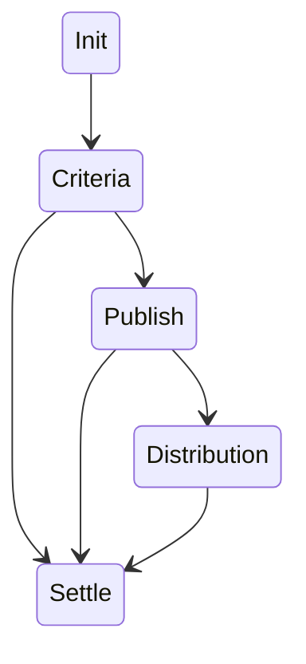

# Campaign Protocol

The Campaign Protocol defines how Campaigners, Delegates, and Indexers collaborate to execute campaigns through a series of well-defined phases. Each phase has specific rules, requirements, and state transitions that ensure secure and predictable campaign execution.

## Campaign Lifecycle

A campaign progresses through five distinct phases:

1. **Init** - Campaign setup and delegate election
2. **Criteria** - Collaborative development of distribution criteria
3. **Publish** - Data collection and validation
4. **Distribution** - Reward allocation decisions
5. **Settle** - Final distribution and campaign completion

Each phase must complete successfully or timeout before moving to the next phase. The protocol ensures campaigns always terminate in the Settle phase, even in failure cases.

## Phase Details

### Init Phase

The Init phase establishes the campaign parameters and elects delegates:

1. **Campaigner Actions**
   - Provides campaign budget
   - Proposes initial criteria
   - Confirms delegate set

2. **Delegate Election**
   ```rust,ignore
   #[authorized(Campaigner)]
   fn elect(Budget, Criteria) -> Result<Vec<Delegate>, Error>

   #[authorized(Campaigner)]
   fn confirm(
       delegates: Vec<Delegate>,
       payment: Payment
   ) -> Transition<Phase::Criteria>
   ```

3. **State Requirements**
   - Budget must be locked
   - Delegates must be staked
   - MAX_EVICTIONS limit enforced

### Criteria Phase

The Criteria phase establishes distribution rules through delegate voting:

1. **Voting Process**
   ```rust,ignore
   struct Vote {
       delegate: Address,
       power: VotingPower,
       weights: Vec<f32>
   }

   #[authorized(Delegate)]
   fn vote(Vote) -> Result<(), Error>
   ```

2. **Quorum Requirements**
   - Minimum voting power threshold
   - Timeout if not reached
   - Slashing for non-participation

3. **Phase Completion**
   ```rust,ignore
   #[authorized(Campaigner)]
   fn confirm(
       weights: Vec<f32>,
       payment: Payment,
       variables: Variables
   ) -> Transition<Phase::Publish>

   #[authorized(Campaigner)]
   fn reject(payment: Payment) -> Transition<Phase::Settle>
   ```

### Publish Phase

The Publish phase collects and validates segment data:

1. **Indexer Submissions**
   ```rust,ignore
   struct Segment<Domain> {
       addresses: Vec<Address<Domain>>,
       amounts: Vec<Amount>
   }

   #[authorized(Indexer)]
   fn publish(segment: Segment) -> Result<(), Error>
   ```

2. **Data Validation**
   - Multiple indexers can submit
   - Dispute resolution process
   - Timeout enforcement

3. **Phase Completion**
   ```rust,ignore
   #[authorized(Campaigner)]
   fn confirm(resolution: Resolution) -> Transition<Phase::Distribution>
   ```

### Distribution Phase

The Distribution phase determines final reward allocations:

1. **Distribution Voting**
   ```rust,ignore
   struct Distribution {
       addresses: Vec<Address>,
       amounts: Vec<Amount>
   }

   #[authorized(Delegate)]
   fn vote_distribution(
       proposal: Distribution,
       vote: Vote
   ) -> Result<(), Error>
   ```

2. **Quorum Requirements**
   - Minimum voting power threshold
   - Delegate participation rules
   - Timeout handling

3. **Phase Completion**
   ```rust,ignore
   #[authorized(Campaigner)]
   fn confirm(
       distribution: Distribution,
       payment: Payment

   ) -> Transition<Phase::Settle>
   ```

### Settle Phase

The Settle phase processes payments and concludes the campaign:

1. **Payment Processing**
   ```rust,ignore
   struct Payment {
       recipient: Address,
       amount: Amount,
       token: TokenId
   }

   #[authorized(Protocol)]
   fn process_payment(payment: Payment) -> Result<(), Error>
   ```

2. **Resource Release**
   - Bond unlocking
   - Stake unbonding
   - State cleanup

## State Transitions

### Valid Transitions


### Transition Rules

1. **Forward Progress**
   - Phases must proceed in order
   - No backward transitions
   - All paths lead to Settle

2. **Timeout Handling**
   ```rust,ignore
   #[authorized(Protocol)]
   fn timeout(phase: Phase) -> Transition<Phase::Settle>
   ```

3. **Error Recovery**
   - Failed phases transition to Settle
   - Resources released properly
   - Slashing applied if necessary

## Failure Modes & Recovery

### Common Failures

1. **Timeout Failures**
   - Delegate non-participation
   - Indexer non-submission
   - Network delays

2. **Consensus Failures**
   - Quorum not reached
   - Conflicting submissions
   - Invalid proposals

3. **Resource Failures**
   - Insufficient funds
   - Stake exhaustion
   - Bond depletion

### Recovery Procedures

1. **Timeout Recovery**
   - Automatic transition to Settle
   - Slashing of non-participants
   - Resource cleanup

2. **Dispute Resolution**
   - Arbitration process
   - Stake slashing
   - Commission adjustments

3. **Resource Recovery**
   - Bond release
   - Stake unbonding
   - Payment reconciliation

## Campaign Bond Protocol

See [Campaign Bonds](./campaign_bonds.md) for detailed specification.

## Implementation Considerations

### Security

1. **Authorization**
   - Role-based access control
   - Signature verification
   - State validation

2. **Economic Security**
   - Bond requirements
   - Stake lockup
   - Slashing conditions

### Performance

1. **State Management**
   - Efficient storage
   - Batch processing
   - Garbage collection

2. **Message Processing**
   - Queue management
   - Parallel execution
   - Load balancing

### Monitoring

1. **Metrics**
   - Phase durations
   - Success rates
   - Resource utilization

2. **Alerts**
   - Timeout warnings
   - Resource depletion
   - Consensus failures
