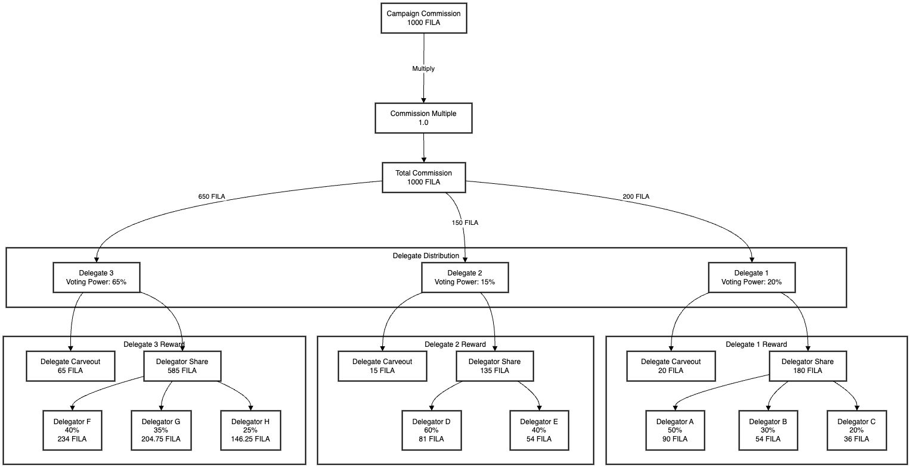

# Commission

1. Campaign Commission Calculation:
    - Campaigners pay a commission for each campaign.
    - The commission is calculated as: median `reward × COMMISSION_MULTIPLE`.
    - For example, if the median reward is 1000\$ and `COMMISSION_MULTIPLE` is 1, the total commission would be 1000$.
2. Delegate Commission Distribution:
    - The total commission is distributed among delegates based on their voting power.
    - For instance, if a delegate has 20% of the total voting power, they would receive 20% of the total commission.
3. Delegate Commission Carveout:
    - Each delegate keeps a fixed percentage of their received commission, defined by `DELEGATE_COMMISSION_CARVEOUT`.
    - For example, if `DELEGATE_COMMISSION_CARVEOUT` is 10%, the delegate would keep 10% of their commission.
4. Delegator Reward Distribution:
    - The remaining commission (after the delegate's carveout) is distributed among the delegate's delegators.
    - Each delegator receives a share proportional to their stake in the delegate's total stake.
    - For example, if a delegator has 50% of the stake for a particular delegate, they would receive 50% of the remaining commission for that delegate.
5. Participation Requirement:
    - To be eligible for these rewards, delegates must participate by voting during the campaign.

### Distributing Commission



### Example Implementation

```rust
use serde::{Serialize, Deserialize};
use std::collections::HashMap;

#[derive(Serialize, Deserialize, Debug)]
struct Delegator {
    id: String,
    stake_percentage: f64,
    reward: f64,
}

#[derive(Serialize, Deserialize, Debug)]
struct Delegate {
    id: u32,
    voting_power: f64,
    commission: f64,
    delegate_share: f64,
    delegator_share: f64,
    delegators: Vec<Delegator>,
}

#[derive(Serialize, Deserialize, Debug)]
struct CommissionDistribution {
    total_commission: f64,
    delegates: Vec<Delegate>,
}

fn calculate_commission_distribution(
    median_campaign_reward: f64,
    num_delegates: u32,
    commission_multiple: f64,
    delegate_commission_carveout: f64,
    delegate_voting_power: &HashMap<u32, f64>,
    delegate_stakes: &HashMap<u32, HashMap<String, f64>>,
) -> CommissionDistribution {
    let total_commission = median_campaign_reward * commission_multiple;
    let mut delegates = Vec::new();

    for delegate_id in 1..=num_delegates {
        let voting_power = delegate_voting_power.get(&delegate_id).unwrap_or(&0.0);
        let commission = total_commission * voting_power;
        let delegate_share = commission * delegate_commission_carveout;
        let delegator_share = commission - delegate_share;

        let mut delegators = Vec::new();
        if let Some(stakes) = delegate_stakes.get(&delegate_id) {
            for (delegator_id, &stake_percentage) in stakes {
                let reward = delegator_share * stake_percentage;
                delegators.push(Delegator {
                    id: delegator_id.clone(),
                    stake_percentage,
                    reward,
                });
            }
        }

        delegates.push(Delegate {
            id: delegate_id,
            voting_power: *voting_power,
            commission,
            delegate_share,
            delegator_share,
            delegators,
        });
    }

    CommissionDistribution {
        total_commission,
        delegates,
    }
}

```

Now, let's use this function with the example data:

```rust
fn main() {
    let median_campaign_reward = 1000.0;
    let num_delegates = 10;
    let commission_multiple = 1.0;
    let delegate_commission_carveout = 0.10;

    let mut delegate_voting_power = HashMap::new();
    delegate_voting_power.insert(1, 0.20);
    delegate_voting_power.insert(2, 0.15);
    delegate_voting_power.insert(3, 0.15);
    delegate_voting_power.insert(4, 0.10);
    delegate_voting_power.insert(5, 0.10);
    delegate_voting_power.insert(6, 0.08);
    delegate_voting_power.insert(7, 0.08);
    delegate_voting_power.insert(8, 0.05);
    delegate_voting_power.insert(9, 0.05);
    delegate_voting_power.insert(10, 0.04);

    let mut delegate_stakes = HashMap::new();
    delegate_stakes.insert(1, {
        let mut stakes = HashMap::new();
        stakes.insert("A".to_string(), 0.50);
        stakes.insert("B".to_string(), 0.30);
        stakes.insert("C".to_string(), 0.20);
        stakes
    });
    delegate_stakes.insert(2, {
        let mut stakes = HashMap::new();
        stakes.insert("D".to_string(), 0.60);
        stakes.insert("E".to_string(), 0.40);
        stakes
    });
    // Add stakes for other delegates...

    let distribution = calculate_commission_distribution(
        median_campaign_reward,
        num_delegates,
        commission_multiple,
        delegate_commission_carveout,
        &delegate_voting_power,
        &delegate_stakes,
    );

    println!("{}", serde_json::to_string_pretty(&distribution).unwrap());
}

```

This will produce a JSON output similar to the following:

```json
{
  "total_commission": 1000,
  "delegates": [
    {
      "id": 1,
      "voting_power": 0.2,
      "commission": 200,
      "delegate_share": 20,
      "delegator_share": 180,
      "delegators": [
        {
          "id": "A",
          "stake_percentage": 0.5,
          "reward": 90
        },
        {
          "id": "B",
          "stake_percentage": 0.3,
          "reward": 54
        },
        {
          "id": "C",
          "stake_percentage": 0.2,
          "reward": 36
        }
      ]
    },
    {
      "id": 2,
      "voting_power": 0.15,
      "commission": 150,
      "delegate_share": 15,
      "delegator_share": 135,
      "delegators": [
        {
          "id": "D",
          "stake_percentage": 0.6,
          "reward": 81
        },
        {
          "id": "E",
          "stake_percentage": 0.4,
          "reward": 54
        }
      ]
    },
    // ... (other delegates)
  ]
}

```

This implementation calculates the commission distribution based on the given parameters and delegate information. The JSON structure provides a clear representation of how the rewards are distributed among delegates and their delegators.

To use this in a real-world scenario, you would need to:

1. Populate the `delegate_voting_power` and `delegate_stakes` hashmaps with actual data from your system.
2. Integrate this function into your larger staking and reward distribution system.
3. Ensure that the calculated rewards are properly distributed to the delegates and delegators, possibly through interactions with the Ethereum staking contract.
