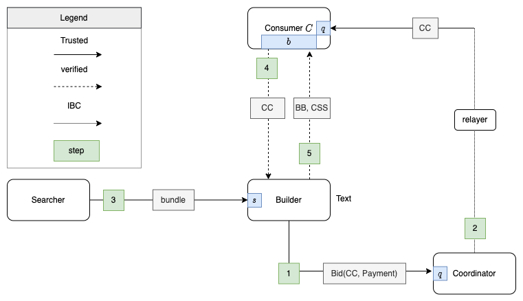
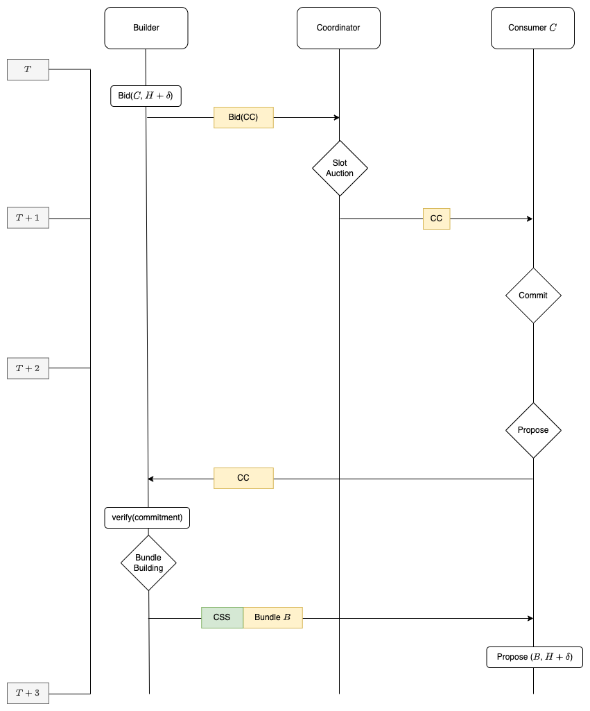

# Mechanism
A first sketch at a protocol for IBC coordinated, low latency, homogenous slot auctioning

## Assumptions

* `homogeneity`  the entire validator set agrees to sell blockspace using the same coordination mechanism
* `correct-relayer` There exist one correct operating relayer
* `bft-safety`  2/3rd of the validator set are correct

## Use Cases
Who would use such a system with such assumptions?

### Consumer Chain

Interchain security  facilitates a shared economic union of zones
governed by Atoms. It makes sense to have a zone  within the union
devoted to coordinating blockspace and enabling atomic cross consumer
chain execution.

### Rollups

It might make sense for rollups which share the same settlement layer to
use such a system to coordinate blockspace auctions and atomic cross
rollup execution

## Properties 

### Novel

#### `builder-representation`
the builder has on-chain representation and can therefore be governed

#### `low-intervention`
Does not require modification of any of the core data structures ie: block header. 

#### `censorship-inefficient`
It should be inefficient and expensive to sustain a censorship attack over multiple blocks

### General

#### `liveness`
it's impossible to prevent progress of the blockchain with less than
1/3rd of the voting power

#### `bundle-unstealabilty`
Let t1 be the time an auction winner propagates its transactions to
proposers and t2 be the time these transactions are being decided. Then,
it must not be possible for any actor, except for the auction winner, to
use any of these transactions before t2.

#### `censorship-resistance`
No actor (with under ⅓+ voting power) should be able to stop the auction
winner from having their valid blocks published or bids from being
submitted to the blockchain in question.

#### `latency`
The builder should be able to decide which transactions are included in
H at H-1

#### Quasi-synchronous atomic cross-chain execution `QSACCE`
it must be possible to execute atomic transactions across multiple
chains at approximately the same time.

## Actors
* Searcher: Finds opportunities in chains
* Builder:  aggregates opportunities into bundles
* Coordinator:  Zone which coordinates the slot auction
* Consumer:  Zone which agrees to sell a governance approved portion of it's blockspace through Coordinator Zone

## Components
- Builder API
	- ABCI 1.0 extension which enables the validators to outsource block building
- coordinator-module
	- module which performs auction slot auction and broadcasts commitments to consumer chain
- consumer-module
	- some module which stores Coordinator Commitments and allows their querying at prepareProposal

## Interfaces
- Builder API
	- Used by the seller chain to fetch the block from the builder
- Query (RPC)
	- Allows the builder to query the commitment (via light client proof) from the Consumer Zones
- Searcher API
	- Interface for submitting bundles to the builder

## Timing Constraints

- 1:  Builder bids on slot
	- Coordinator confirms block with winning bid - 1 block on coordination chain
- 2: Coordinator relays commitment to Consumer
	- IBC Message SendPacket - 1 block on consumer chain
- 3: Proposer on consumer requests payload using CC
	- same block

## Implementation Intuitions

### Objects

#### Builder Bundle `BB`  
The builder builds bundles of transactions which may be partial or potentially full block

#### Coordinator Commitments `CC` 
The coordinator makes commitments to the builder to sell slot on the consumer chain upon winning a slot auction

#### Commitment Satisfaction Schemes `CSS`
messages signed by the builder which tell the validator set how to
verify that the the builders bundle has been included correctly by the
proposer, example: offset, length, hash of transactions

### Payments
Payments are included at upon auction conclusion with confirmation of the CC
Payments can be governance gated and distributed based on:
- floor-price
- authorized builder
- distribution
	- proposer (all or proposer)
		- probably makes sense for all proposers share equally
	- stakers
	- community pool
	- escrowed with a delayed distribution
		- MEV smoothing
	- LPs
	- ...?

### `CC` Representation
CC Commitments are stored on-chain, verifiable via light client proofs
and replicated over IBC They include: 

`chain_id , height , builder_key , builder_api_url`

### `CC` verification

- on prepare proposal
	- data-availability : A random subset of the validators query the builder parameterized by the `CC`
		- validators act as oracle and submit evidence that the `CSS` was available
- At pre-vote, the validators of the consumer chain:
	- extract the builder public key from the `CC`
	- extract the `CSS` from the proposal
	- verify the signature of the builder specified in `CC` against the `CSS`
- if CC verification fails:
	- the Proposer is is censoring the builder
		- `proposer-cc-censorship`
	- CC  was not available  (see data-availability remark above)
		- the block CC expires, the builders payment is distributed according to the distribution
			- `builder-cc-withholding`

### `CSS` Representation
- `CSS` can be the first transaction in a block and used by the state machine to verify that the CC was respected by the proposer of the consumer chain 

### `css-absence`
- A block with A CC but no CSS . Should be skipped

## Analysis
*Does the implementation provide have a chance at fulfilling the desired properties*

### Novel
`builder-representation`
Governing the builder can be done in the coordinator module. The coordinator chain accepts CC as transactions signed by builders. It can accept/reject builder submissions based on whitelist/blacklist reputation.

`low-intervention`
All functionality can be implemented in the coordinator and consumer modules. All input can be custom transactions. State modifications can be verified using light client proof on on-chain state.

`censorship-inefficient`
The easiest option to prevent long term censorship is to
On missing a block with a CC being proposed without the correspond CSS refund the builder and make them skip builder subsequent blocks allowing organic transaction flow to be finalized without them.

### General
#### `liveness`
A builder can censor the consumer chain by withholding the CSS
In this case the consumer chain will produce an empty block but will still produce blocks. For transaction censorship see censorship resistance see censorship-resistance

#### `bundle-unstealability`
At block proposal time on the consumer chain, the proposer will query the builder with the CC . The builder can then verify the commitment before providing the CSS .  

However, if the CC is for offset>0, then it's possible for the proposer to read the bundle and create MEV stealing transactions above the CC bundle. It is therefore essential to either

A. Strictly allow CC where offset=0
B. The space above the bundle execution zone is reserved for governance sanctioned transactions signed by designated accounts
	use case: protocol owned liquidations, etc
	
	
#### `cartel-formation`
What if the proposer of block H colludes with the proposer of H+1 to:
	part.1: Query the BB  from the builder
	part.2:  Steal the MEV and share it the proposer for H+1

The problem with this attack is that the proposer for H+1 might also
have a CC and so may not have access to top of block However that is
definitely possible. Data availability can be used to provide on
economic (slashing) protection.

#### `censorship-resistance`
Censoring the builder from submitting bids is akin to censoring the coordinator chain.  However, the proposer of block H with corresponding CC can censor the builder by just refusing to query the builder when it's their time to propose. The only way around this is to use data-availability sampling such that validators can provide evidence against the proposer if they do not retrieve the block

#### Caveat
- if the CSS request from validators to builders is authenticated, the builder can selectively reveal who they provide the BB to and essentially grief the proposer to trigger their slashing. This is broken.
potential-bandaid
- A. Use a trusted third party relay to broker the availability
	- but someone needs to sign the CSS :thinking: 
- B. Use Pulzaar for encryption/data availability and slash the proposer unconditionally upon css-absence 

#### `QSACCE`
With a slot auction `QSACCE` is achieved by:
- Aligning the block timing on the desired consumer chains
- winning the slots which align in time on corresponding zones
	- Notes: The builder will know ahead of time if it can offer this to searchers or not

## Future Work

`css-absence` is a point of contention because it introduces ambiguity as to who is to blame. data-availability properties should be fleshed out but the concenquences need to be understood in the context of cartel-formation 
 
`extended-bundle-unstealability`  we can extend the bundle-unstealability property to make bundles unstealable beyond t2 and potentially unstealable until they are finalized

intentions  The coordination chain can add intention type transactions which users generate and searchers need to bid on for the right to execute. For instance an intention to swap which is settled by routing contracts on the coordination chain with eventual settlement on consumer chain. 

`pre-commit-privacy` many of the issues of `data-availability` , `css-absence` and `cartel-formation` might be solved by providing `pre-commit-privacy `

Ensure the the mechanism is credible.

## Research
- [Builder vs Slot Auction - Julian Ma](https://mirror.xyz/0x03c29504CEcCa30B93FF5774183a1358D41fbeB1/CPYI91s98cp9zKFkanKs_qotYzw09kWvouaAa9GXBrQ)
- [Credible Commitments -
  Flashbots](https://github.com/flashbots/mev-research/blob/main/FRPs/active/FRP-26.md)
- [Interchain Scheduler Design Update - Informal
  Systems](https://informal.systems/2022/10/24/interchain-scheduler-design-update)
- [Credible Mechanism - Mohammad Akbarpour, Shengwu
  Li](https://web.stanford.edu/~mohamwad/CredibleMechanisms.pdf)

