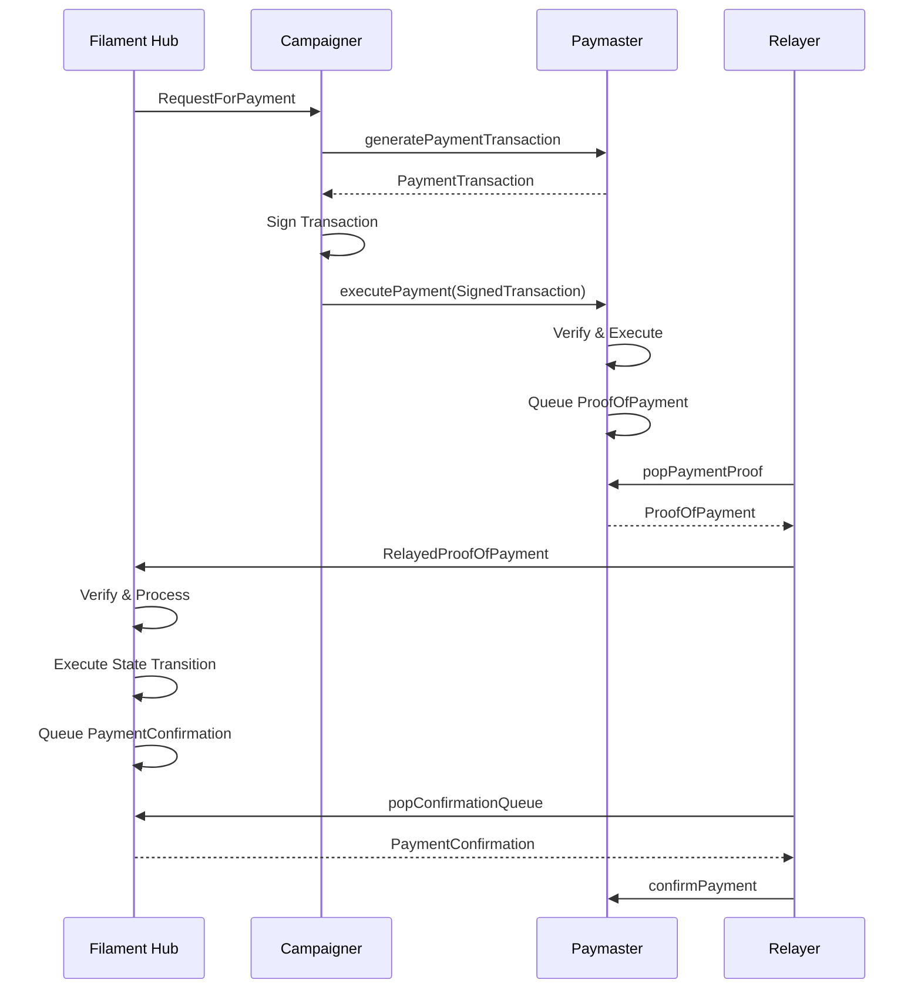

# Paymaster

## **Motivation**

The Filament Hub Protocol requires payments to be made between Campaigners and Delegates for various operations in different phases of a campaign (Init, Criteria, Publish, and Distribution). To keep the Filament Hub as a Layer 2 protocol with minimal token bridging, a decentralized solution is needed for handling payments on Ethereum (Layer 1). The **Paymaster** contract will handle payments and generate a **ProofOfPayment**, which is then validated by the Filament Hub for state transitions.

## Considerations

1. Campaigner UX
    1. They should be able to pay from their bond, liquid $FILA or aquire discounted $FILA from the treasury window
    2. They should only need to sign a single transaction on the Paymaster
    3. Reliability: The relayer should be trusted but account for failures. Messages have exact once transmission 

## Actors

- Campaigner
    - Role: Initiates and manages campaigns, makes payments for various actions.
    - Responsibilities:
        - Funds their account with FILA and USDC tokens
        - Manages campaign bonds for each of their campaigns
        - Initiates payment transactions in response to RequestForPayments
        - Signs payment transactions before sending to the Paymaster
        - Monitors their campaign status and manages funds across different funding sources
- Filament Hub
    - Role: Central coordination point for the protocol, manages campaign states and payment requests.
    - Responsibilities:
        - Calculates fees for various actions (Criteria, Publish, Distribution phases)
        - Generates RequestForPayments and sends them to Campaigners
        - Verifies and processes ProofOfPayments received from the Relayer
        - Executes state transitions based on confirmed payments
        - Generates PaymentConfirmations and queues them for the Relayer
        - Maintains the overall state of all campaigns
- Paymaster (Smart Contract)
    - Role: Manages funds and executes payment transactions on the blockchain.
    - Responsibilities:
        - Holds FILA tokens for campaign bonds
        - Generates PaymentTransactions based on RequestForPayments
        - Verifies signatures on payment transactions
        - Executes fund transfers from various sources (Campaign Bond, FILA balance, or USDC via Treasury Window)
        - Generates and queues ProofOfPayments
        - Manages campaign bond balances and watermarks
        - Interacts with FILA and USDC tokens, and the Treasury Window
- Relayer
    - Role: Facilitates communication between the Paymaster and Filament Hub.
    - Responsibilities:
        - Monitors the Paymaster's ProofOfPayment queue
        - Relays ProofOfPayments from the Paymaster to the Filament Hub
        - Tracks in-flight messages and implements retry logic
        - Relays PaymentConfirmations from the Filament Hub back to the Paymaster
        - Ensures exact-once delivery of messages between Paymaster and Filament Hub
- Treasury Window
    - Role: Facilitates the exchange of USDC for FILA at a controlled rate.
    - Responsibilities:
        - Provides exchange rates for USDC to FILA
        - Executes USDC to FILA conversions

## Key Concepts

1. RequestForPayment: Initiated by the Filament Hub to request payment for state transitions.
2. PaymentTransaction: Generated by the Paymaster to execute the payment.
3. ProofOfPayment: Evidence of a successful payment, generated by the Paymaster.
4. PaymentConfirmation: Acknowledgment of a processed payment by the Filament Hub.
5. Relayer: Facilitates communication between the Paymaster and Filament Hub.
6. Campaign Bond: A deposit of FILA tokens that a campaigner can use for payments, managed per campaign.
7. Watermark: A minimum balance that must be maintained in the Campaign Bond.
8. Treasury Window: A mechanism for purchasing FILA with USDC at a controlled rate.

## Protocol Flow



## Core Data Structures

### Filament Hub (Rust)

```rust
struct RequestForPayment {
    campaign_id: u64,
    phase: Phase,
    message: Message,
    amount: u64,
    from: Address,
    nonce: u64,
}

struct RelayedProofOfPayment {
    proof: ProofOfPayment,
    relayer: Address,
}

struct PaymentConfirmation {
    request_id: u64,
    status: PaymentStatus,
    action_result: ActionResult,
}

enum PaymentStatus {
    Confirmed,
    Failed,
}

enum Phase {
    Criteria,
    Publish,
    Distribution,
}

enum Message {
    Commit,
    Reject,
}

```

### Paymaster (Solidity)

```solidity
struct CampaignBond {
    uint256 balance;
    uint256 watermark;
}

struct PaymentTransaction {
    uint256 requestId;
    uint256 campaignId;
    uint8 phase;
    uint8 message;
    uint256 amount;
    address from;
    uint256 nonce;
    FundSource fundSource;
}

enum FundSource {
    CampaignBond,
    FilaBalance,
    TreasuryWindow
}

struct ProofOfPayment {
    uint256 requestId;
    uint256 campaignId;
    uint8 phase;
    uint8 message;
    uint256 amount;
    address from;
    uint256 nonce;
    FundSource fundSource;
}

```

## Implementation of Filament Hub State Transitions (Rust)

```rust
impl FilamentHub {
    fn calculate_fee(&self, campaign_id: u64, phase: Phase, message: Message) -> RequestForPayment {
        let amount = self.fee_calculator.calculate(campaign_id, phase, message);
        let from = self.get_campaign_owner(campaign_id);
        let nonce = self.get_next_nonce(campaign_id);

        RequestForPayment {
            campaign_id,
            phase,
            message,
            amount,
            from,
            nonce,
        }
    }

    fn process_proof_of_payment(&mut self, relayed_proof: RelayedProofOfPayment) -> Result<PaymentConfirmation, Error> {
        self.verify_proof(&relayed_proof.proof)?;
        let action_result = self.execute_state_transition(&relayed_proof.proof)?;

        let confirmation = PaymentConfirmation {
            request_id: relayed_proof.proof.request_id,
            status: PaymentStatus::Confirmed,
            action_result,
        };

        self.payment_confirmations.push(confirmation.clone());
        Ok(confirmation)
    }

    fn execute_state_transition(&mut self, proof: &ProofOfPayment) -> Result<ActionResult, Error> {
        match (proof.phase, proof.message) {
            (Phase::Criteria, Message::Commit) => self.criteria_commit(proof),
            (Phase::Criteria, Message::Reject) => self.criteria_reject(proof),
            (Phase::Publish, Message::Commit) => self.publish_commit(proof),
            (Phase::Publish, Message::Reject) => self.publish_reject(proof),
            (Phase::Distribution, Message::Commit) => self.distribution_commit(proof),
            (Phase::Distribution, Message::Reject) => self.distribution_reject(proof),
        }
    }

    // Implement individual state transition functions
    fn criteria_commit(&mut self, proof: &ProofOfPayment) -> Result<ActionResult, Error> {
        // Implement Criteria Commit logic
        Ok(ActionResult::default())
    }

    // ... Implement other state transition functions ...
}

```

## Relayer Logic (Rust)

```rust
struct Relayer {
    paymaster: Paymaster,
    filament_hub: FilamentHub,
    in_flight_messages: HashMap<u64, InFlightMessage>,
    retry_interval: Duration,
    max_retries: u32,
}

struct InFlightMessage {
    proof: ProofOfPayment,
    attempts: u32,
    last_attempt: Instant,
}

impl Relayer {
    fn run(&mut self) {
        loop {
            self.process_payment_queue();
            self.retry_in_flight_messages();
            self.process_confirmation_queue();
            std::thread::sleep(Duration::from_secs(1));
        }
    }

    fn process_payment_queue(&mut self) {
        while let Some(proof) = self.paymaster.pop_payment_queue() {
            self.relay_proof_of_payment(proof);
        }
    }

    fn relay_proof_of_payment(&mut self, proof: ProofOfPayment) {
        let message_id = proof.nonce;
        self.in_flight_messages.insert(message_id, InFlightMessage {
            proof: proof.clone(),
            attempts: 1,
            last_attempt: Instant::now(),
        });
        self.send_to_filament_hub(message_id);
    }

    fn send_to_filament_hub(&mut self, message_id: u64) {
        if let Some(message) = self.in_flight_messages.get(&message_id) {
            let relayed_proof = RelayedProofOfPayment {
                proof: message.proof.clone(),
                relayer: self.address,
            };
            match self.filament_hub.process_proof_of_payment(relayed_proof) {
                Ok(confirmation) => self.handle_success(message_id, confirmation),
                Err(_) => {} // Will be retried later
            }
        }
    }

    fn handle_success(&mut self, message_id: u64, confirmation: PaymentConfirmation) {
        self.in_flight_messages.remove(&message_id);
        self.paymaster.confirm_payment(confirmation);
    }

    fn retry_in_flight_messages(&mut self) {
        // Implement retry logic
    }

    fn process_confirmation_queue(&mut self) {
        while let Some(confirmation) = self.filament_hub.pop_confirmation_queue() {
            self.paymaster.confirm_payment(confirmation);
        }
    }
}

```

## Paymaster Contract (Solidity)

```solidity
pragma solidity ^0.8.0;

import "@openzeppelin/contracts/token/ERC20/IERC20.sol";
import "@openzeppelin/contracts/token/ERC20/utils/SafeERC20.sol";

contract Paymaster {
    using SafeERC20 for IERC20;

    struct CampaignBond {
        uint256 balance;
        uint256 watermark;
    }

    mapping(address => mapping(uint256 => CampaignBond)) public campaignBonds;

    IERC20 public filaToken;
    IERC20 public usdcToken;
    ITreasuryWindow public treasuryWindow;

    constructor(address _filaToken, address _usdcToken, address _treasuryWindow) {
        filaToken = IERC20(_filaToken);
        usdcToken = IERC20(_usdcToken);
        treasuryWindow = ITreasuryWindow(_treasuryWindow);
    }

    function generatePaymentTransaction(RequestForPayment memory request) public view returns (PaymentTransaction memory) {
        FundSource fundSource = determineFundSource(request.from, request.campaignId, request.amount);
        return PaymentTransaction({
            requestId: request.nonce,
            campaignId: request.campaignId,
            phase: uint8(request.phase),
            message: uint8(request.message),
            amount: request.amount,
            from: request.from,
            nonce: request.nonce,
            fundSource: fundSource
        });
    }

    function determineFundSource(address campaigner, uint256 campaignId, uint256 amount) internal view returns (FundSource) {
        CampaignBond storage bond = campaignBonds[campaigner][campaignId];
        if (bond.balance > bond.watermark && (bond.balance - bond.watermark) >= amount) {
            return FundSource.CampaignBond;
        }
        if (filaToken.balanceOf(campaigner) >= amount) {
            return FundSource.FilaBalance;
        }
        uint256 requiredUsdc = treasuryWindow.getRequiredUsdcForFila(amount);
        if (usdcToken.balanceOf(campaigner) >= requiredUsdc) {
            return FundSource.TreasuryWindow;
        }
        revert("Insufficient funds for payment");
    }

    function executePayment(PaymentTransaction memory transaction, bytes memory signature) public {
        require(verifySignature(transaction, signature), "Invalid signature");
        require(sufficientFunds(transaction), "Insufficient funds");

        executeFundTransfer(transaction);

        ProofOfPayment memory proof = ProofOfPayment({
            requestId: transaction.requestId,
            campaignId: transaction.campaignId,
            phase: transaction.phase,
            message: transaction.message,
            amount: transaction.amount,
            from: transaction.from,
            nonce: transaction.nonce,
            fundSource: transaction.fundSource
        });

        queuePaymentProof(proof);
    }

    function executeFundTransfer(PaymentTransaction memory transaction) internal {
        if (transaction.fundSource == FundSource.CampaignBond) {
            deductFromCampaignBond(transaction.from, transaction.campaignId, transaction.amount);
        } else if (transaction.fundSource == FundSource.FilaBalance) {
            filaToken.safeTransferFrom(transaction.from, address(this), transaction.amount);
        } else if (transaction.fundSource == FundSource.TreasuryWindow) {
            uint256 requiredUsdc = treasuryWindow.getRequiredUsdcForFila(transaction.amount);
            usdcToken.safeTransferFrom(transaction.from, address(this), requiredUsdc);
            uint256 receivedFila = treasuryWindow.buyFilaWithUsdc(requiredUsdc);
            require(receivedFila >= transaction.amount, "Insufficient FILA received from Treasury");
            if (receivedFila > transaction.amount) {
                filaToken.safeTransfer(transaction.from, receivedFila - transaction.amount);
            }
        }
    }

    function addToCampaignBond(uint256 campaignId, uint256 amount) public {
        filaToken.safeTransferFrom(msg.sender, address(this), amount);
        campaignBonds[msg.sender][campaignId].balance += amount;
    }

    function setCampaignBondWatermark(uint256 campaignId, uint256 watermark) public {
        // Add appropriate access control here
        campaignBonds[msg.sender][campaignId].watermark = watermark;
    }

    function withdrawFromCampaignBond(uint256 campaignId, uint256 amount) public {
        CampaignBond storage bond = campaignBonds[msg.sender][campaignId];
        require(bond.balance - amount >= bond.watermark, "Cannot withdraw below watermark");
        bond.balance -= amount;
        filaToken.safeTransfer(msg.sender, amount);
    }

    // Other necessary functions...
}

```

## Analysis of Failure Modes

1. Replay Attacks: Mitigated by using nonces in RequestForPayment and verifying signatures in Paymaster.
2. Insufficient Funds: Checked in Paymaster's executePayment function before processing.
3. Relayer Failures: Handled by retry mechanism in Relayer, ensuring eventual delivery.
4. Network Partitions: In-flight message tracking ensures no double-processing.
5. Filament Hub Failures: Confirmation queue ensures payments are not lost if Filament Hub goes down temporarily.
6. Token Transfer Failures: Use of SafeERC20 prevents common ERC20 vulnerabilities.
7. Treasury Window Failures: Checked before executing USDC to FILA conversion.

The system accomplishes exact-once message processing between the Filament Hub and Paymaster through:

1. Unique nonces for each request: Prevents replay attacks and ensures each transaction is unique.
2. In-flight message tracking by the Relayer: Keeps track of messages that have been sent but not yet confirmed.
3. Confirmation mechanism: Acknowledges processed payments, preventing double-processing.
4. Retry logic for failed deliveries: Ensures messages are eventually delivered, even in case of temporary failures.
5. Queue-based approach in both Paymaster and Filament Hub: Provides a buffer for processing payments and confirmations.
6. Atomic execution of payments in the Paymaster: Ensures that a payment is either fully processed or not processed at all.
7. State transition execution in Filament Hub: Ties the payment to a specific state change, preventing duplicate applications of the same payment.

This design ensures that even in the face of temporary failures or network issues, each payment will be processed exactly once, maintaining the integrity and consistency of the system. The use of ERC20 tokens and safe transfer methods adds an additional layer of security and reliability to the financial transactions within the system.