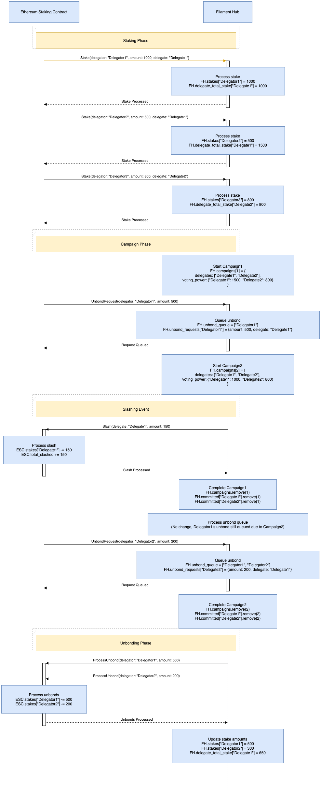

# Staking

## 1. Overview

The Filament Staking system is designed to allow FILA token holders to participate in the campaigns by staking their tokens. The system consists of two main components: an Ethereum-based staking contract and the Filament Hub.

## 2. Components

### 2.1 Ethereum Staking Contract

The Ethereum Staking Contract manages the actual FILA token stakes and processes stake-related actions.

### 2.2 Filament Hub

The Filament Hub manages campaign participation, unbounding requests, and synchronizes with the Ethereum Staking Contract.

## 3. Key Concepts

### 3.1 Staking

Users can stake their FILA tokens to participate in the network and potentially earn rewards.

### 3.2 Delegation

Stakers (delegators) can delegate their staked tokens to delegates, who participate in campaigns on their behalf.

### 3.3 Campaigns

Periodic events where elected delegates participate in governance or other network activities.

### 3.4 Unbounding

The process of withdrawing staked tokens, subject to certain conditions and delays.

### 3.5 Slashing

A penalty mechanism for misbehaving delegates, affecting both the delegate and their delegators.

## 4.  Specifications

### 4.1 Staking and Delegation

1. Users can stake any amount of FILA tokens.
2. When staking, users must choose a delegate.
3. A user's stake increases the total voting power of their chosen delegate.
4. Users can add to their stake at any time.
5. Delegates are a predefined set of addresses approved by the Filament Hub.

### 4.2 Campaigns

1. The Filament Hub initiates campaigns periodically.
2. For each campaign, a set of delegates is elected to participate.
3. When a delegate is elected to a campaign, their voting power to that campaign does not include the voting power contributed by delegators who are in the unbonding queue
4. Elected delegates and their delegators are committed to the campaign until its conclusion.
5. Committed stakes cannot be unbounded until the campaign concludes.

### 4.3 Unbounding Mechanism

1. Users can request to unbound their staked tokens at any time.
2. If the user (delegator) is not committed to any active campaigns, the unbounding request is processed immediately.
3. If the user is committed to one or more active campaigns:
a. The unbounding request is queued.
b. The request remains in the queue until all committed campaigns conclude.
4. When a campaign concludes:
a. The Filament Hub processes the unbounding queue.
b. Any queued requests for delegators no longer committed to any campaigns are processed.
5. Processed unbounding requests result in the return of staked tokens to the user after a predefined delay period.

### 4.4 Slashing

1. Delegates can be slashed for misbehavior or failing to participate in campaigns.
2. When a delegate is slashed:
a. A portion of their staked tokens is deducted.
b. The slash is proportionally applied to all delegators of that delegate.
3. Slashing occurs even if there are pending unbounding requests.

### 4.5 Rewards

[Commission Distribution](./commission.md)

## 5. Example Implementation



### 5.1 Ethereum Staking Contract

The following code exemplary. It is broken and should not be relied upon.

```solidity
// SPDX-License-Identifier: MIT
pragma solidity ^0.8.0;

import "@openzeppelin/contracts/token/ERC20/IERC20.sol";
import "@openzeppelin/contracts/access/Ownable.sol";

contract FilamentStaking is Ownable {
    IERC20 public filaToken;

    struct Stake {
        uint256 amount;
        address delegate;
    }

    struct UnbondRequest {
        uint256 amount;
        uint256 requestTime;
    }

    mapping(address => Stake) public stakes;
    mapping(address => UnbondRequest) public unbondRequests;
    mapping(address => bool) public isDelegate;

    event Staked(address indexed delegator, address indexed delegate, uint256 amount);
    event UnbondRequested(address indexed delegator, uint256 amount);
    event Unbonded(address indexed delegator, uint256 amount);
    event Slashed(address indexed delegate, uint256 amount);

    constructor(address _filaToken) {
        filaToken = IERC20(_filaToken);
    }

    function stake(uint256 amount, address delegate) external {
        require(isDelegate[delegate], "Invalid delegate");
        require(filaToken.transferFrom(msg.sender, address(this), amount), "Transfer failed");

        stakes[msg.sender].amount += amount;
        stakes[msg.sender].delegate = delegate;

        emit Staked(msg.sender, delegate, amount);
    }

    function requestUnbond(uint256 amount) external {
        require(stakes[msg.sender].amount >= amount, "Insufficient stake");

        unbondRequests[msg.sender] = UnbondRequest(amount, block.timestamp);
        emit UnbondRequested(msg.sender, amount);
    }

    function processUnbond(address delegator) external onlyOwner {
        UnbondRequest memory request = unbondRequests[delegator];
        require(request.amount > 0, "No unbond request");

        delete unbondRequests[delegator];
        stakes[delegator].amount -= request.amount;

        require(filaToken.transfer(delegator, request.amount), "Transfer failed");
        emit Unbonded(delegator, request.amount);
    }

    function slash(address delegate, uint256 amount) external onlyOwner {
        require(isDelegate[delegate], "Not a delegate");
        stakes[delegate].amount -= amount;
        emit Slashed(delegate, amount);
    }

    function setDelegate(address delegate, bool status) external onlyOwner {
        isDelegate[delegate] = status;
    }
}

```

### 5.2 Filament Hub

```rust
use std::collections::{HashMap, VecDeque};

type Address = String;

struct Stake {
    amount: u64,
    delegate: Address,
}

struct UnbondRequest {
    amount: u64,
    request_time: u64,
    delegator: Address,
    delegate: Address,
}

struct Campaign {
    id: u64,
    elected_delegates: Vec<Address>,
    delegate_voting_power: HashMap<Address, u64>,
}

struct FilamentHub {
    stakes: HashMap<Address, Stake>,
    unbond_requests: HashMap<Address, UnbondRequest>,
    campaigns: HashMap<u64, Campaign>,
    committed: HashMap<Address, Vec<u64>>,
    unbond_queue: VecDeque<Address>,
    delegate_total_stake: HashMap<Address, u64>,
}

impl FilamentHub {
    fn new() -> Self {
        FilamentHub {
            stakes: HashMap::new(),
            unbond_requests: HashMap::new(),
            campaigns: HashMap::new(),
            committed: HashMap::new(),
            unbond_queue: VecDeque::new(),
            delegate_total_stake: HashMap::new(),
        }
    }

    fn start_campaign(&mut self, campaign_id: u64, elected_delegates: Vec<Address>) {
        let mut delegate_voting_power = HashMap::new();

        for delegate in &elected_delegates {
            let voting_power = self.calculate_delegate_voting_power(delegate);
            delegate_voting_power.insert(delegate.clone(), voting_power);
        }

        let campaign = Campaign {
            id: campaign_id,
            elected_delegates: elected_delegates.clone(),
            delegate_voting_power,
        };
        self.campaigns.insert(campaign_id, campaign);

        for delegate in elected_delegates {
            if let Some(commitments) = self.committed.get_mut(&delegate) {
                commitments.push(campaign_id);
            } else {
                self.committed.insert(delegate, vec![campaign_id]);
            }
        }
    }

    fn calculate_delegate_voting_power(&self, delegate: &Address) -> u64 {
        let total_stake = self.delegate_total_stake.get(delegate).cloned().unwrap_or(0);
        let unbonding_stake: u64 = self.unbond_requests.values()
            .filter(|req| req.delegate == *delegate)
            .map(|req| req.amount)
            .sum();
        total_stake.saturating_sub(unbonding_stake)
    }

    fn request_unbond(&mut self, delegator: Address, amount: u64) {
        if let Some(stake) = self.stakes.get(&delegator) {
            if stake.amount >= amount {
                let delegate = stake.delegate.clone();
                if let Some(commitments) = self.committed.get(&delegate) {
                    if commitments.is_empty() {
                        self.process_unbond(&delegator, amount);
                    } else {
                        let request = UnbondRequest {
                            amount,
                            request_time: self.current_time(),
                            delegator: delegator.clone(),
                            delegate: delegate.clone(),
                        };
                        self.unbond_requests.insert(delegator.clone(), request);
                        self.unbond_queue.push_back(delegator);
                    }
                } else {
                    self.process_unbond(&delegator, amount);
                }
            }
        }
    }

    fn complete_campaign(&mut self, campaign_id: u64) {
        if let Some(campaign) = self.campaigns.remove(&campaign_id) {
            for delegate in campaign.elected_delegates {
                if let Some(commitments) = self.committed.get_mut(&delegate) {
                    commitments.retain(|&x| x != campaign_id);
                }
            }
        }

        self.process_unbond_queue();
    }

    fn process_unbond_queue(&mut self) {
        let mut processed = Vec::new();

        for delegator in &self.unbond_queue {
            if let Some(request) = self.unbond_requests.get(delegator) {
                if let Some(commitments) = self.committed.get(&request.delegate) {
                    if commitments.is_empty() {
                        self.process_unbond(delegator, request.amount);
                        processed.push(delegator.clone());
                    }
                }
            }
        }

        for delegator in processed {
            self.unbond_requests.remove(&delegator);
            self.unbond_queue.retain(|x| x != &delegator);
        }
    }

    fn process_unbond(&mut self, delegator: &Address, amount: u64) {
        if let Some(stake) = self.stakes.get_mut(delegator) {
            stake.amount = stake.amount.saturating_sub(amount);
            if let Some(total_stake) = self.delegate_total_stake.get_mut(&stake.delegate) {
                *total_stake = total_stake.saturating_sub(amount);
            }
            // Here you would typically call the Ethereum contract to transfer tokens
            println!("Processed unbond for {} with amount {}", delegator, amount);
        }
    }

    fn current_time(&self) -> u64 {
        // This would typically be implemented to return the current block time
        0
    }

    fn add_stake(&mut self, delegator: Address, amount: u64, delegate: Address) {
        if let Some(stake) = self.stakes.get_mut(&delegator) {
            stake.amount += amount;
        } else {
            self.stakes.insert(delegator, Stake { amount, delegate: delegate.clone() });
        }
        *self.delegate_total_stake.entry(delegate).or_insert(0) += amount;
    }

    fn get_campaign_voting_power(&self, campaign_id: u64, delegate: &Address) -> Option<u64> {
        self.campaigns.get(&campaign_id)
            .and_then(|campaign| campaign.delegate_voting_power.get(delegate).cloned())
    }
}

fn main() {
    let mut hub = FilamentHub::new();

    // Example usage
    hub.add_stake("delegator1".to_string(), 1000, "delegate1".to_string());
    hub.add_stake("delegator2".to_string(), 500, "delegate1".to_string());
    hub.add_stake("delegator3".to_string(), 800, "delegate2".to_string());

    hub.start_campaign(1, vec!["delegate1".to_string(), "delegate2".to_string()]);

    println!("Delegate1 voting power in campaign 1: {:?}",
             hub.get_campaign_voting_power(1, &"delegate1".to_string()));

    hub.request_unbond("delegator1".to_string(), 500);

    hub.start_campaign(2, vec!["delegate1".to_string(), "delegate2".to_string()]);

    println!("Delegate1 voting power in campaign 2: {:?}",
             hub.get_campaign_voting_power(2, &"delegate1".to_string()));

    hub.complete_campaign(1);
    hub.process_unbond_queue();

    println!("Delegate1 voting power after unbonding: {:?}",
             hub.calculate_delegate_voting_power(&"delegate1".to_string()));
}

```

## 6. Key Functions

### 6.1 Ethereum Staking Contract

1. `stake(uint256 amount, address delegate)`
2. `requestUnbond(uint256 amount)`
3. `processUnbond(address delegator)`
4. `slash(address delegate, uint256 amount)`

### 6.2 Filament Hub

1. `start_campaign(campaign_id: u64, elected_delegates: Vec<Address>)`
2. `request_unbond(delegator: Address, amount: u64)`
3. `complete_campaign(campaign_id: u64)`
4. `process_unbond_queue()`

## 7. Interaction Between Components

1. The Filament Hub maintains the list of active delegates and campaigns.
2. The Ethereum Staking Contract holds the actual staked tokens and processes stake/unbond actions.
3. The Filament Hub instructs the Ethereum Staking Contract when to process unbonds or apply slashes.
4. The Filament Hub syncs stake information from the Ethereum Staking Contract to calculate voting power and rewards.

## 8. Security Considerations

1. The unbounding mechanism ensures that stakers cannot avoid slashing by quickly unbounding during active campaigns.
2. The queuing system for unbounding requests prevents stake manipulation during critical periods.
3. Slashing affects both delegates and delegators, incentivizing careful delegate selection.
4. The Ethereum Staking Contract should only accept instructions from the authorized Filament Hub address.

This specification provides a comprehensive overview of the Filament Staking system, detailing its components, mechanisms, and key functions. It ensures a secure and fair staking system that aligns with the goals of preventing abuse while allowing legitimate unbounding of stakes.
